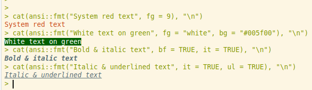

# {ansi}: Decorate text printed to console

ANSI escape codes are character sequences that terminal emulators and the R
recognize as specifying the color or style of text printed to the console.
This intentionally lightweight package provides a simple interface to use some
of this functionality, namely causing text to be a different color, boldfaced,
italicized, and/or underlined. Users wanting a similar package with more
features should consider the R package [{cli}](https://github.com/r-lib/cli).
The purpose of this package is to provide a more lightweight package with a
simple interface to cover many common use cases with less overhead.

## Installation

Many people install packages from GitHub using `devtools::install_github()`.
You can install {ansi} using that function or `remotes::install_github()`;
[{devtools}](https://github.com/r-lib/devtools) actually imports this from
[{remotes}](https://github.com/r-lib/remotes) and re-exports it. Most people
call from {devtools}, but if you do not want to install {devtools} and all
its dependencies, you can use the more lightweight package {remotes}:

```r
remotes::install_github("duckmayr/ansi")
```

## Using `{ansi}`

The main function provides is `ansi::fmt()`. You can specify the color of text
printed to console with the argument `fg`, the background color of text printed
to console with the argument `bg`, and you can boldface, italicize, or
underline the text printed to console by setting the `bf`, `it`, and `ul`
arguments respectively to TRUE:

```r
ansi::fmt("This text is system red", fg = 9)
ansi::fmt("This text is white on green", fg = "white", bg = "#005f00")
ansi::fmt(
    "This text is boldface, italicized, and underlined",
    bf = TRUE, it = TRUE, ul = TRUE
)
```



As demonstrated above, you can specify text or background colors using:

- Anything R recognizes as a color, such as
  + RGB specification, like `rgb(0, 1, 1)`
  + Hexcode specification, like `#005f00`
  + Color names, like `"darkgreen"`
- A number from 0 to 255
  + Colors 0 to 15 are the 16 system colors: black, maroon, green, olive, navy,
    purple, teal, silver, gray, red, lime, yellow, magenta, cyan, and white
  + Colors 232 to 255 are a grayscale block moving from #080808 to #eeeeee
  + Colors 16 to 231 are colors increment red, blue, and/or green between
    '00', '5f', '87', 'af', 'd7', and 'ff'
  + You can see these colors at <https://www.ditig.com/256-colors-cheat-sheet>
